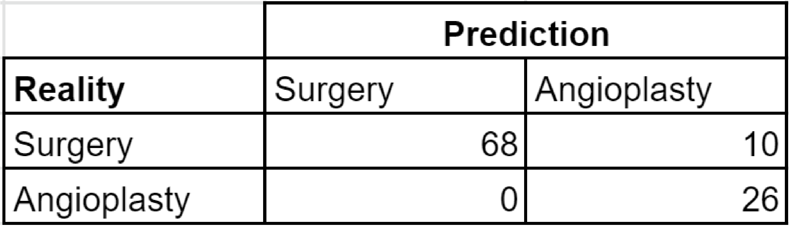

# Introduction

This report aims to, through medical data analysis, give an understanding of the dataset that was given to the team, and to use and train a ML model in order to predict the procedure to be performed on patients based on their medical backround, represented in the dataset variables, as accurately as possible.

The dataset used in this assignment was given by Austral University Hospital's cardiology department, located in Pilar, Buenos Aires.

This document is organized into three sections: Data Analysis, which shows generalized queries on the dataset; Interpretation, which seeks to give further understanding of the given dataset in its context, and Predictor, where the engineering behind the model is explained.

To analyze the dataset in the correct way and extract the richest information we started with researching the variables meaning, medical terms included, and cardiological procedures from different information sources. We then proceeded with the implementation of data analysis tools and strategies to fulfill our objectives.

#  Data Analysis 
In this section we evaluate different variables in the dataset and show graphs.

<p>&nbsp;</p>
<font size="5"> **Sex and Age** </font>

As an initial dataset analysis, a Sex and Age query was made. It is a basic analysis to be done in order to understand the distribution in our patients sample.


```{r, include = FALSE, results='asis'}
library(plotrix)
library(plotly)
library(ggplot2)
library(ggridges)
library(dplyr)
library(hrbrthemes)
library(Hmisc)
library(XML)
library(reshape2)
library(plyr)
library(ggplot2)
library(viridis)
library(rmdformats)
library(tufte)
library(lattice)
library(caret)
library(randomForest)
library(CHAID)
library(ROCR)


dataset <- read.csv("dataset.csv", sep=";")
x <- cut2(dataset$EDAD, seq(10,90,5))

yes <- dataset$SEXO
displayIngresoSegunEdad<- table(dataset$SEXO,dataset$EDAD)
displayIngresoSegunEdad
textIntervals <- as.character(x)
f <- as.data.frame(table(x))

df <- data.frame(textIntervals, yes)

counts <- ddply(df, .(df$textIntervals, df$yes), nrow)
names(counts) <- c("ageInterval", "Sexo", "Freq")
counts

## pyramid charts are two barcharts with axes flipped

counts$Freq <- ifelse(counts$Sexo == "MASC", -1*counts$Freq, counts$Freq)

pyramid <- ggplot(counts, aes(x = counts$ageInterval, y = counts$Freq, fill = counts$Sexo)) + 
  geom_bar(data = subset(counts, counts$Sexo == "Female"), stat = "identity") +
  geom_bar(data = subset(counts, counts$Sexo == "Male"), stat = "identity") +
  scale_y_continuous(breaks = seq(-60, 60, 10),labels = paste0(as.character(c(seq(60, 0, -10), seq(10, 60, 10))),'')) + 
  coord_flip() + 
  xlab("Age") + ylab("Number Of Patients")+
  scale_fill_manual(name = "Sex", labels = c("Female", "Male"),values = c("#87CEEB","#36a792"))+
  theme_bw()

```

```{r fig.width=6, fig.height=6, fig.align='center',echo=FALSE}
pyramid
```

This pyramid graph allows to observe the sex distribution by age. There is a much higher percentage of men in the dataset, which are mainly concentrated between 60 and 70 years old.

Due to the fact that most patients in the dataset are part of the interval of older age, research was done in order to understand the influence of age in cardiological events and treatments.

According to  Dr. Ann Bowling [1]:


> "The rates of use of potentially life saving and life enhancing investigations and interventions decline as patients get older.
[...]
The ageing of the population is one of the major challenges facing health services."
>
> `r tufte::quote_footer('Dr. Ann Bowling')`


From this study, it is possible to conclude that age has a significant influence in events and treatments. Because of this, further analysis will be done contemplating age as a major factor.


<p>&nbsp;</p>
<font size="5.5"> **Reason for Admission** </font>

```{r, include = FALSE, results='asis'}
displayIngresoSegunEdad<- table(dataset$MOTIVO.DE.INGRESO,dataset$EDAD)
motivoIngreso<- factor(dataset$MOTIVO.DE.INGRESO)
motivoIngreso

yes <- dataset[which(dataset$MOTIVO.DE.INGRESO == "PROG CORONARIO" | dataset$MOTIVO.DE.INGRESO == "PROG VALV" | dataset$MOTIVO.DE.INGRESO == "SCA no SST"),]
yes
x <- cut2(yes$EDAD, seq(10,90,15))


displayIngresoSegunEdad<- table(yes$MOTIVO.DE.INGRESO,yes$EDAD)
displayIngresoSegunEdad
textIntervals <- as.character(x)
f <- as.data.frame(table(x))

df <- data.frame(textIntervals, yes)

counts <- ddply(df, .(df$textIntervals, df$MOTIVO.DE.INGRESO), nrow)
names(counts) <- c("ageInterval", "Motivo", "Freq")
counts

plot <-ggplot(counts, aes(fill=counts$ageInterval, y=counts$Freq, x=counts$Motivo)) + 
  geom_bar(position="stack", stat="identity")+
  scale_fill_manual(labels = c('[10;25)','[25;40)','[40;55)','[55;70)','[70;85)','[85;92)'),values = c("#4169E1","#015d67","#36a792","#63bd99","#87CEEB","#B0E0E6"))+
  xlab("Reason for Admission") + ylab("Frequency")+
  labs(fill = "Age Intervals")

plot

```
```{r fig.width=8, fig.height=6, fig.align='center',echo=FALSE,warning=FALSE}
plot
```

The aim of this graph is to show the main causes of admission in the Hospital, according to the age of the patients. It is possible to see that Coronary Programmed Operations stands out as the most common reason.
<p>&nbsp;</p>
<font size="5.5"> **Procedures according to Age** </font>

```{r, include = FALSE, results='asis'}
datasetSinNA = dataset[which(dataset$PROCEDIMIENTO != "CIRUGIA, ENDOVALVULA"),]
distributionPlot<-datasetSinNA %>%
  ggplot(aes(x= EDAD, fill = PROCEDIMIENTO,..count..*10)) +
  geom_density(alpha = 0.5) +
  theme_ridges() +
  scale_fill_manual(name = "Procedure:", labels = c("Surgery","Angioplasty","Mitral Valve Rep."), values = c("#015d67","#16c2d5","#3CB371"),) +
  theme(legend.position = "top")+
  labs(x="Age", y = "Density")
```
```{r fig.width=6, fig.height=6, fig.align='center',echo=FALSE,warning=FALSE}
distributionPlot
```

This graph shows how procedures are distributed according to the age of the patient. Mitral Valve Replacement far outweighs as the most recurrent procedure in the oldest ages.
<p>&nbsp;</p>
<font size="5.5"> **Types of Surgery** </font>

As seen on the previous analysis, it is possible to see that a large proportion of patients end up in Surgery. Because of this, a query was made in order to understand the distribution of surgery types.

```{r, include = FALSE, results='asis'}
subdatasetCirugia <- dataset[which(dataset$PROCEDIMIENTO == "CIRUGIA" & (dataset$TIPO.DE.CIRUGIA != "#N/A" & dataset$TIPO.DE.CIRUGIA != "TUMORES DE AURICULA" & dataset$TIPO.DE.CIRUGIA != "TROMBECTOMIA PULMONAR" & dataset$TIPO.DE.CIRUGIA != "PLASTICA TRICUS, OTRA" & dataset$TIPO.DE.CIRUGIA != "PERICARDIECTOMIA" & dataset$TIPO.DE.CIRUGIA != "DOBLE REEMPLAZO VALVULAR")),]
tiposDeCirugias<- factor(subdatasetCirugia$TIPO.DE.CIRUGIA)
tablaTiposDeCirugias <- table(tiposDeCirugias)
tablaTiposDeCirugias

subdatasetCirugia$TIPO.DE.CIRUGIA[subdatasetCirugia$TIPO.DE.CIRUGIA == "RVM"] <- "Myocardical Revascularization"
subdatasetCirugia$TIPO.DE.CIRUGIA[subdatasetCirugia$TIPO.DE.CIRUGIA == "CRM PURA"] <- "PURE CRM"
subdatasetCirugia$TIPO.DE.CIRUGIA[subdatasetCirugia$TIPO.DE.CIRUGIA == "REEMPLAZO VALVULAR PULMONAR"] <- "Pulmonary Valve Replacement"
subdatasetCirugia$TIPO.DE.CIRUGIA[subdatasetCirugia$TIPO.DE.CIRUGIA == "OTRA"] <- "Other"
subdatasetCirugia$TIPO.DE.CIRUGIA[subdatasetCirugia$TIPO.DE.CIRUGIA == "ANEURISMA AORTICO"] <- "Aortic Aneurysm"
subdatasetCirugia$TIPO.DE.CIRUGIA[subdatasetCirugia$TIPO.DE.CIRUGIA == "CIA"] <- "Interatrial Communication"
subdatasetCirugia$TIPO.DE.CIRUGIA[subdatasetCirugia$TIPO.DE.CIRUGIA == "PLASTICA MITRAL"] <- "Mitral Valve Repair"

tiposDeCirugias

subdatasetCRM = dataset[which(dataset$CRM == "true"),]
numCRM = as.numeric(nrow(subdatasetCRM))
numCRMPura = as.numeric(length(factor(which(subdatasetCRM$TIPO.DE.CIRUGIA == "CRM PURA"))))
percentage<- paste(round((numCRMPura/numCRM)*100), "%", sep="") #Porcentaje de CRMS que son CRM puras
percentage
numCirugia = as.numeric(nrow(subdatasetCirugia))
percentage2<- paste(round((numCRM/numCirugia)*100), "%", sep="") #Porcentaje de Cirugias que son CRM
percentage2
```
```{r fig.width=6, fig.height=6, fig.align='center',echo=FALSE,warning=FALSE}
subdatasetCirugia %>% 
  ggplot(aes(y=TIPO.DE.CIRUGIA), position=position_dodge()) + 
  geom_bar( width = 0.85, color = "#36a792", fill = "#87CEEB") +
  scale_fill_brewer() +
  theme(legend.position="top")+
  ylab("Type of Surgery") +
  xlab("Frequency")
```

In this frequency graph it is clearly seen how CRM and RVAO are the most common types of surgery.
<p>&nbsp;</p> 
<font size="5.5"> **Complications** </font>

In the dataset, information was given according to two categories: surgery (in general) and angioplasty. Starting from this, the sample proportion of complications was calculated according to the different procedures.

```{r, include = FALSE, result = 'asis'}
pacientesATC <- dataset[which(dataset$PROCEDIMIENTO == "ANGIOPLASTIA"),]
tablaAtc = table(pacientesATC$COMPLICACIONES.ANGIOPLASTIA)

prop.table(tablaAtc)

porcentageNoCompAng <- paste(round((tablaAtc[1]/217)*100), "%", sep="")
porcentageCompAng <- paste(round((tablaAtc[2]/217)*100), "%", sep="")

pacientesCRM <- dataset[which(dataset$PROCEDIMIENTO == "CIRUGIA"),]

totalDeCirugia = nrow(pacientesCRM)

cantCompCRM <- nrow(pacientesCRM[which(pacientesCRM$COMPLICACIONES.INMEDIATAS == 1 | pacientesCRM$COMPLICACIONES.TARDIAS == 1),])

cantCompCRM_I <- nrow(pacientesCRM[which(pacientesCRM$COMPLICACIONES.INMEDIATAS == 1 & pacientesCRM$COMPLICACIONES.TARDIAS == 0 ),])
cantCompCRM_T <- nrow(pacientesCRM[which(pacientesCRM$COMPLICACIONES.INMEDIATAS == 0 & pacientesCRM$COMPLICACIONES.TARDIAS == 1),])
cantCompCRM_IyT<- nrow(pacientesCRM[which(pacientesCRM$COMPLICACIONES.INMEDIATAS == 1 & pacientesCRM$COMPLICACIONES.TARDIAS == 1),])

cantidadTotal = cantCompCRM_I + cantCompCRM_IyT + cantCompCRM_T
porComplicaciones = cantidadTotal/totalDeCirugia;
sinComplicaciones = totalDeCirugia - cantidadTotal

tablaCRM = cbind(c(cantidadTotal),c(sinComplicaciones))
tablaCRM
prop.table(tablaCRM)
A <- matrix(nrow=1,ncol=2, c(cantidadTotal,sinComplicaciones), byrow=TRUE)

porcNoCompCrm <- paste(round((as.numeric(A[1,2]/161)*100)), "%", sep="")
porcCompCrm <- paste(round((as.numeric(A[1,1]/161)*100)), "%", sep="")
```
### *Angioplasty*
```{r fig.width=6, fig.height=6, fig.align='center',echo=FALSE,warning=FALSE}
colores <- c("#87CEEB", "#36a792")
RegionLabels<-c(porcentageNoCompAng,porcentageCompAng)
pieATC <-pie(tablaAtc, RegionLabels, col = colores,)
legendLabels = c("No Complications","Complications")
legend("topright", legendLabels, cex = 0.8, fill = colores)
```
This pie graph shows, based on the analyzed data, how angioplasty appears not being a procedure that results in numerous complications.

### *Surgery*
```{r fig.width=6, fig.height=6, fig.align='center',echo=FALSE,warning=FALSE}
colores2 <- c("#36a792", "#87CEEB")
RegionLabels<-c(porcCompCrm,porcNoCompCrm)
pieSurgery<-pie(tablaCRM, RegionLabels, col = colores2)
legendLabels = c("Complications","No Complications")
legend("topright", legendLabels, cex = 0.8, fill = colores2)
```
In contrast to angioplasty, a significant percentage of surgery patients in the dataset suffer complications.

# Interpretation 
In this section we look for information from relations and comparisons between variables.
<p>&nbsp;</p>

<font size="5.5"> **Number of injuries according to CCA (Complex Coronary Anatomy)** </font>

According to a study by Dr. Hu and Dr. Iftikhar from UC Riverside, U.S.A. [2], patients with CCA present a challenge when procedures are performed. An analysis was made in order to assert this information in the sample.

```{r, include = FALSE, result = 'asis'}
subsetNoACC <- dataset[which(dataset$ANATOMIA.CORONARIA.COMPLEJA == 0 & 
                               dataset$NUMERO.DE.LESIONES != "#N/A"),]
frecNumLesionesNoACC <- c(as.numeric(length(factor(
  which(subsetNoACC$NUMERO.DE.LESIONES == 0)))), 
  as.numeric(length(factor(which(subsetNoACC$NUMERO.DE.LESIONES == 1)))), 
  as.numeric(length(factor(which(subsetNoACC$NUMERO.DE.LESIONES == 2)))), 
  as.numeric(length(factor(which(subsetNoACC$NUMERO.DE.LESIONES == 3)))),  
  as.numeric(length(factor(which(subsetNoACC$NUMERO.DE.LESIONES == 4)))), 
  as.numeric(length(factor(which(subsetNoACC$NUMERO.DE.LESIONES == 5))))) 

subsetACC <- dataset[which(dataset$ANATOMIA.CORONARIA.COMPLEJA == 1 & 
                             dataset$NUMERO.DE.LESIONES != "#N/A"),]

frecNumLesionesACC <- c(as.numeric(length(factor(which(subsetACC$NUMERO.DE.LESIONES == 0)))), 
                        as.numeric(length(factor(which(subsetACC$NUMERO.DE.LESIONES == 1)))), 
                        as.numeric(length(factor(which(subsetACC$NUMERO.DE.LESIONES == 2)))), 
                        as.numeric(length(factor(which(subsetACC$NUMERO.DE.LESIONES == 3)))),  
                        as.numeric(length(factor(which(subsetACC$NUMERO.DE.LESIONES == 4)))), 
                        as.numeric(length(factor(which(subsetACC$NUMERO.DE.LESIONES == 5))))) 


cols1<- c("0 Injuries", "1 Injury", "2 Injuries", "3 Injuries", "4 Injuries", "5 Injuries")
rows1<- c("ACC", "No ACC")

procedACC_data <- data.frame(frecNumLesionesACC,frecNumLesionesNoACC, row.names = cols1)

colnames(procedACC_data)[1]<-"ACC"
colnames(procedACC_data)[2]<-"No ACC"


```
```{r fig.width=9, fig.height=5, fig.align='center',echo=FALSE,warning=FALSE}
barplot(t(as.matrix(procedACC_data)),beside=TRUE,xlab="Injuries", ylab="Frequency", col=c("#066150", "#87CEEB"),
        legend.text = colnames(procedACC_data),args.legend=list(cex=0.75,x = "topright"),alpha = 0.6)
  
```
In this graph it is possible to appreciate how most of the CCA patients are located in the zone between 3 and 5 injuries, while the rest of the patients are mainly located in the zone between 0 and 2 injuries.
<p>&nbsp;</p>
<font size="5.5"> **Procedure Distrubution** </font>
<br></br>

An important analysis to do was the distribution of the procedures carried out according to some factors related to the patients. Factors evaluated as influential include pre-existing  medical conditions, such as diabetes, obesity and age, among others. 


<font size="4.8"> **Procedure Frequency by Risk Factor** </font>

```{r, include= FALSE,results='asis'}
riskCirugia <- dataset[which(dataset$PROCEDIMIENTO == "CIRUGIA"),] 
frecRiesgoCirugia<- c(as.numeric(length(factor(which(riskCirugia$EPOC == 1)))), as.numeric(length(factor(which(riskCirugia$DIABETES == 1)))), as.numeric(length(factor(which(riskCirugia$HIPERTENSION.PULMONAR == 1)))), as.numeric(length(factor(which(riskCirugia$OBESIDAD.MORBIDA == 1)))),  as.numeric(length(factor(which(riskCirugia$EDAD >65)))), as.numeric(length(factor(which(riskCirugia$FEY <50))))) 
cols<- c("EPOC", "Diabetes", "Lung Hypertension", "Morbid Obesity", "Age above 65", "FEY less than 50")
rows<- c("Cirugia", "Angioplastia")
riskATC <- dataset[which(dataset$PROCEDIMIENTO == "ANGIOPLASTIA"),]
frecRiesgoATC<- c(as.numeric(length(factor(which(riskATC$EPOC == 1)))), as.numeric(length(factor(which(riskATC$DIABETES == 1)))), as.numeric(length(factor(which(riskATC$HIPERTENSION.PULMONAR == 1)))), as.numeric(length(factor(which(riskATC$OBESIDAD.MORBIDA == 1)))),  as.numeric(length(factor(which(riskATC$EDAD >65)))), as.numeric(length(factor(which(riskATC$FEY <50))))) 

procedRisksData<-data.frame(frecRiesgoCirugia,frecRiesgoATC, row.names = cols)
colnames(procedRisksData)[1]<-"Surgery"
colnames(procedRisksData)[2]<-"Angioplasty"

procedRisksData
```
```{r fig.width=10, fig.height=5, fig.align='center',echo=FALSE,warning=FALSE}
barplot(t(as.matrix(procedRisksData)),beside=TRUE,xlab="Risk Factors", ylab="Frequency", col=c("#499c8c","#87CEEB"),
        legend.text = colnames(procedRisksData),args.legend=list(cex=0.75,x = "topright"))
```
The aim of this graph is to show the frequency of procedures according to the main risk factors in the dataset. It can easily be seen how diabetic patients  and the ones above 65 years old end up in some kind of procedure, mainly angioplasty.


<font size="4.8"> **Procedure according to affected vessels** </font>

Furthermore, an analysis of the influence of a non pre-existing factor was also made, which are affected vessels when the patient needs to be treated.
```{r, include = FALSE, result = 'asis'}
subdatasetVasosAfectados = dataset[which(dataset$Resumen.Coronariopatia !="#N/A" & dataset$Resumen.Coronariopatia !="TCI solo"),]
displayVasosProced <- table(subdatasetVasosAfectados$PROCEDIMIENTO,subdatasetVasosAfectados$Resumen.Coronariopatia)
displayVasosProced

subdatasetVasosAfectados
vasosCirugiaAngioplastia <- subdatasetVasosAfectados[which(subdatasetVasosAfectados$PROCEDIMIENTO == "CIRUGIA" | subdatasetVasosAfectados$PROCEDIMIENTO == "ANGIOPLASTIA"),]
unVaso<-vasosCirugiaAngioplastia[which(vasosCirugiaAngioplastia$Resumen.Coronariopatia == "1 vaso"),]
dosVasos<-vasosCirugiaAngioplastia[which(vasosCirugiaAngioplastia$Resumen.Coronariopatia == "2 vasos"),]
tresVasos<-vasosCirugiaAngioplastia[which(vasosCirugiaAngioplastia$Resumen.Coronariopatia == "3 vasos"),]

coronopatia<- c(c("1 vessel", "1 vessel"), c("2 vessels", "2 vessels"),c("3 vessels", "3 vessels"))
procedimiento<- c("Surgery", "Angioplasty","Surgery", "Angioplasty","Surgery", "Angioplasty")
values<- c(nrow(unVaso[which(unVaso$PROCEDIMIENTO == "CIRUGIA"),]),nrow(unVaso[which(unVaso$PROCEDIMIENTO == "ANGIOPLASTIA"),]),nrow(dosVasos[which(dosVasos$PROCEDIMIENTO == "CIRUGIA"),]),nrow(dosVasos[which(dosVasos$PROCEDIMIENTO == "ANGIOPLASTIA"),]),nrow(tresVasos[which(tresVasos$PROCEDIMIENTO == "CIRUGIA"),]),nrow(tresVasos[which(tresVasos$PROCEDIMIENTO == "ANGIOPLASTIA"),]))
dataVasosProced <- data.frame(procedimiento,coronopatia,values)
grafico1<-ggplot(dataVasosProced, aes(fill=procedimiento, y=values ,x=procedimiento),) + 
  geom_bar(position="dodge", stat="identity", color="black") +
  scale_fill_viridis(discrete = T, option = "E") +
  facet_wrap(~coronopatia,nrow = 1) +
  theme_ipsum() +
  theme(legend.position="none") +
  scale_fill_manual(values = c("#499c8c","#87CEEB"))+
  xlab("")
```
```{r fig.width=8, fig.height=6, fig.align='center',echo=FALSE,warning=FALSE,cache=FALSE, results=FALSE, warning=FALSE, comment=FALSE}
grafico1
```
This graph visually represents how most of the patients with 1 and 2 affected vessels end up in angioplasty, while 3 vessels patients are almost equally distributed between angioplasty and surgery.
<p>&nbsp;</p>

# Predictor 

<font size="5.5"> **Random Forest Model** </font>

El principal proposito de este trabajo es el de lograr predecir con el mayor grado de certeza que procedimiento se llevara a cabo en un paciente, de acuerdo a su edad, si es diabetico, o segun su motivo de ingreso.

Para hacerlo, se decidio usar el metodo RandomForest.

Con este modelo llegamos a la siguiente matriz de confusión:



Con este modelo llegamos a predecir a donde iban dirigidos 88 de 104 pacientes teniendo una precisión del 85%. Respecto a este test, 16 pacientes que deberían ir a cirugía fueron a angioplastía. Con estos resultados, se decidio mantener este predictor por su baja cantidad de predicciones fallidas comparada a la total y su precisión.

<font size="5.5"> **AUROC Curve** </font>

```{r, include = FALSE, result = 'asis'}

datasetCP <- dataset[which((
  dataset$MOTIVO.DE.INGRESO=="PROG CORONARIO" | 
    dataset$MOTIVO.DE.INGRESO=="PROG VALV"| 
    dataset$MOTIVO.DE.INGRESO=="SCA no SST") & ( 
      dataset$PROCEDIMIENTO != "CIRUGIA, ENDOVALVULA")),]

datasetCP2 <- datasetCP[which(datasetCP$PROCEDIMIENTO != "ENDOVALVULA"),]

#FACTOREO

datasetCP2$EDAD <- cut(datasetCP2$EDAD, breaks = c(0,55,93),labels = c("NO RISK AGE","RISK AGE"), right = FALSE)
datasetCP2$EDAD <- as.factor(datasetCP2$EDAD)
datasetCP2$DIABETES <- as.factor(datasetCP2$DIABETES)
#datasetCP$NUMERO.DE.LESIONES <- as.factor(datasetCP$NUMERO.DE.LESIONES)
#datasetCP$ANATOMIA.CORONARIA.COMPLEJA <- as.factor(datasetCP$ANATOMIA.CORONARIA.COMPLEJA)
datasetCP2$PROCEDIMIENTO <- as.factor(datasetCP2$PROCEDIMIENTO)
#datasetCP$Resumen.Coronariopatia <- as.factor(datasetCP$Resumen.Coronariopatia)
datasetCP$MOTIVO.DE.INGRESO <- as.factor(datasetCP$MOTIVO.DE.INGRESO)


#Con este dataset queremos predecir a donde va.

smp_size <- floor(0.7 * nrow(datasetCP2))
set.seed(123)
train_ind <- sample(seq_len(nrow(datasetCP2)), size = smp_size)

train <- droplevels(datasetCP2[train_ind, ]) #[filas,columnas]
test <- datasetCP2[-train_ind, ]

#RANDOM FOREST:

modelForest <- randomForest(PROCEDIMIENTO ~ EDAD + DIABETES + MOTIVO.DE.INGRESO,data = train,ntree=500)

modelForest

predF <- predict(modelForest,type = "class",test)


table(test$PROCEDIMIENTO,predF,dnn = c("Reality", "Predict"))

confusionMatrix(predF,test$PROCEDIMIENTO)

plotROC <- function(predF){
  perf<- performance(predF,"tpr","fpr")
  plot(perf)
  AUC<-performance(predF,"auc")@y.values[[1]]
  grid()
  text(.6,.2,sprintf("AUC=%0.3f", AUC))
  abline(0,1,col="red", lty = 2)
}

predaux<-prediction(as.numeric(predF),test$PROCEDIMIENTO)

perf <- performance(predaux, "auc")
perf@y.values[[1]]


```
```{r fig.width=8, fig.height=6, fig.align='center',echo=FALSE,warning=FALSE,cache=FALSE, results=FALSE, warning=FALSE, comment=FALSE}
plotROC(predaux)
```


El valor de esta curva es de 0.846. Al ser un numero cercano a 1 y con la cantidad de datos que se pasaron, esta es una buena curva que representa una buena predicción, mostrando la baja cantidad de predicciones fallidas.


## {.unnumbered}

# Team Members

#### [Camila Catalini](mailto:camila.catalini@ing.austral.edu.ar)
#### [Santiago Encina](mailto:santiago.encina@ing.austral.edu.ar)
#### [Matias Coulougian](mailto:matias.coulougian@ing.austral.edu.ar)
#### [Ricardo Lopez Bonaguro](mailto:ricardo.lopez@ing.austral.edu.ar)
#### [Alejo Demitropulos Macchi](mailto:alejo.demitropulos@ing.austral.edu.ar)


# Bibliography

1. Bowling A. (1999). Ageism in cardiology. BMJ (Clinical research ed.), 319(7221), 1353–1355. https://doi.org/10.1136/bmj.319.7221.1353 - Retrieved on June 17th, 2021.

2. Iftikhar, S. and Hu, P., 2020. Complex Coronary Artery Lesions. [online] Available at: https://www.ncbi.nlm.nih.gov/books/NBK539899/#article-19791.s14 Retrieved on June 17th, 2021.